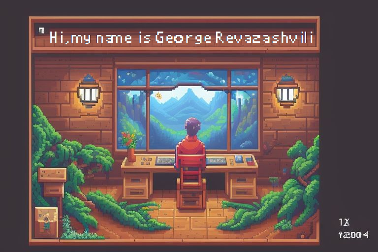

<!--### Всем привет 👋 -->
<!-- <h2 align="center">Всем привет! Меня зовут <a href="https://github.com/zigfrei" target="_blank">Георгий</a>  -->

  

<!-- </h2> -->
 <h3 align="center"> Изучаю веб разработку, со специализацией на фронтенде. Изучаю и работаю с : 
 
 
 
 
 
 
 
 
 
 
 
 
</h3>
 
 <h4 align="center"> Для подержания мозгйовой активности не забываем решать задачки </h4>
 <h4 align="center">

</h4>
 <h4 align="center">
<!-- 
</h4>

**zigfrei/zigfrei** is a ✨ _special_ ✨ repository because its `README.md` (this file) appears on your GitHub profile.

Here are some ideas to get you started:

- 🔭 I’m currently working on ...
- 🌱 I’m currently learning ...
- 👯 I’m looking to collaborate on ...
- 🤔 I’m looking for help with ...
- 💬 Ask me about ...
- 📫 How to reach me: ...
- 😄 Pronouns: ...
- ⚡ Fun fact: ...
-->
